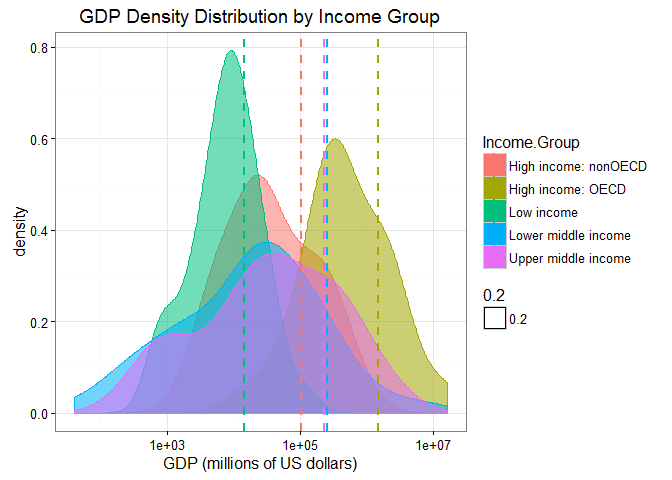

# Case Study I:  Country Data and Analysis
Angela Horacek  
October 27, 2016  
###Introduction
The objective of the assignment was to create a reproducible project using GitHub and Git.  Two datasets from The Data World Bank website were downloaded consisting of a 2012 global GDP(Gross Domestic Product) and ranking by country dataset and a global education data set that specifically contained income levels by country.  The two datasets were downloaded, cleaned, and merged. An analysis of the data was completed requiring the use of the short country codes, GDP, and Income.Group columns. 


### Download Data
The Download_Rev2.R file downloads two datasets from The World Bank website, and places each dataset in a .csv file.  The .csv files are read into R as dataframes.


```r
setwd("C:/Users/Angela/Documents/1_SMU/Courses/MSDS6306DoingDataScience/CaseStudy1/MSDS6306_CaseStudyI/Data")
source ("MSDS6306CaseStudy1_Download_Rev2.R", print.eval=FALSE, echo=FALSE)
```


### Clean Data
The MSDS6306CaseStudy1_Clean_Rev2.R file tidys and merges the two datasets.  


```r
setwd("C:/Users/Angela/Documents/1_SMU/Courses/MSDS6306DoingDataScience/CaseStudy1/MSDS6306_CaseStudyI/Data")
source ("MSDS6306CaseStudy1_Clean_Rev2.R", print.eval=FALSE, echo=FALSE)
```


### Analyze Data
The MSDS6306CaseStudy1_Analyze_Rev2.R file analyzes the data to answer the study questions. 

```r
setwd("C:/Users/Angela/Documents/1_SMU/Courses/MSDS6306DoingDataScience/CaseStudy1/MSDS6306_CaseStudyI/Analyze")
source ("MSDS6306CaseStudy1_Analyze_Rev2.R", print.eval=FALSE, echo=FALSE)
```

####Answer 1:
There are 189 matching IDs.

####Answer 2:
The 13th country from the sorted data is St. Kitts and Nevis. 

####Answer 3:
The average GDP ranking for the "High income: OECD" group is 32.97 and for the "High income: nonOECD" group is 91.91.

####Answer 4:

```r
print(SummaryStat)
```

```
## # A tibble: 5 × 4
##           Income.Group    MeanGDP   Median `Standard Deviation`
##                 <fctr>      <dbl>    <dbl>                <dbl>
## 1 High income: nonOECD  104349.83  28373.0            165334.45
## 2    High income: OECD 1483917.13 486528.5           3070463.52
## 3           Low income   14410.78   7843.0             20473.09
## 4  Lower middle income  256663.48  24272.0           1139619.92
## 5  Upper middle income  231847.84  42945.0            476872.04
```

```r
print(Plot1)
```

<!-- -->

####Answer 5:

```r
print(IncGroupQuantile.table)
```

```
##                       GDP.Ranking.Quantile.Groups
## Income.Group           (1,48] (48,95] (95,143] (143,190]
##                             0       0        0         0
##   High income: nonOECD      4       8        7         4
##   High income: OECD        22       6        1         0
##   Low income                0       5       17        15
##   Lower middle income       9      14       14        17
##   Upper middle income      12      14        8        11
```
The number of countries that are in Lower Middle Income but among the 38 nations with the highest GDP is 17. 


###Conclusion
The analysis from question one confirms that the datasets from The Data World Bank provide GDP and group income level information for all 189 countries in the world. 

Although sorting the data in ascending GDP order revealed the 13th country, the analysis also quickly exposed Tuvula as having the lowest GDP,$40 MM, and the US as having the highest GDP,$16,244,600 MM. 

Thirdly, the average GDP ranking for high income-OECD countries is approximately 2.8 times the average GDP ranking of high income nonOECD countries intimating that the cooperative economic style may be economically beneficial to member countries. 

Fourthly, the GDP Density Distibution by Income Group plot shows the five distribution incomes along with their mean GDP. The lower middle and upper middle income groups have similar distributions with close means and the largest variances of all the groups.  The low income group has the smallest variance of all the groups. All income group distributions are right skewed

Lastly, the GDP.Ranking.Quantile.Groups versus Income.Group table indicates unexpected Quantile groups based on the country's labeled income groupings. For example, some countries in high income groups are in the third and fourth quantile GDP rankings. Conversely, there are some lower middle income and even yet low income groups that are in the first and second quantile ranking groups. 

