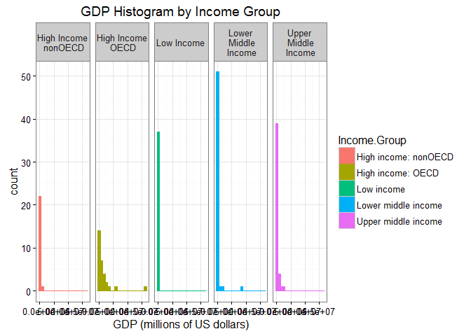
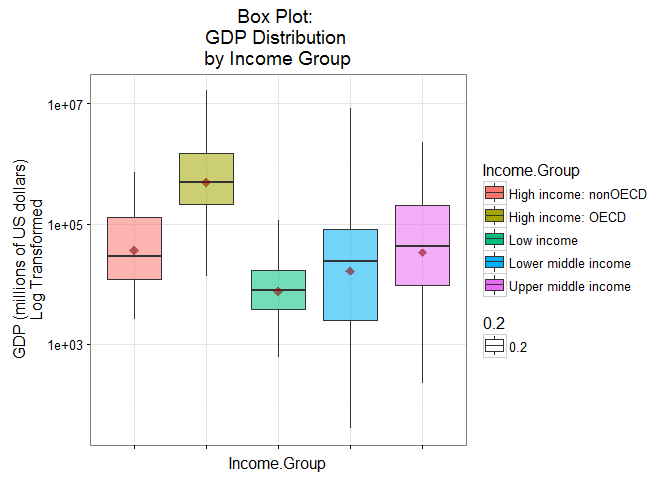

# Case Study I:  Country Data and Analysis
Angela Horacek  
October 27, 2016  
###Introduction
The objective of the assignment was to create a reproducible project using GitHub and Git.  Two datasets from The Data World Bank website were downloaded consisting of a 2012 global GDP(Gross Domestic Product) and ranking by country dataset and a global education data set that specifically contained income levels by country.  The two datasets were downloaded, cleaned, and merged. An analysis of the data was completed requiring the use of the short country codes, GDP, and Income.Group columns. 


### Download Data
The Download_Rev2.R file downloads two datasets from The World Bank website, and places each dataset in a .csv file.  The .csv files are read into R as dataframes.


```r
setwd("C:/Users/Angela/Documents/1_SMU/Courses/MSDS6306DoingDataScience/CaseStudy1/MSDS6306_CaseStudyI/Data")
source ("MSDS6306CaseStudy1_Download_Rev2.R", print.eval=FALSE, echo=FALSE)
```


### Clean Data
The MSDS6306CaseStudy1_Clean_Rev2.R file tidys and merges the two datasets.  


```r
setwd("C:/Users/Angela/Documents/1_SMU/Courses/MSDS6306DoingDataScience/CaseStudy1/MSDS6306_CaseStudyI/Data")
source ("MSDS6306CaseStudy1_Clean_Rev2.R", print.eval=FALSE, echo=FALSE)
```


### Analyze Data
The MSDS6306CaseStudy1_Analyze_Rev2.R file analyzes the data to answer the study questions. 

```r
setwd("C:/Users/Angela/Documents/1_SMU/Courses/MSDS6306DoingDataScience/CaseStudy1/MSDS6306_CaseStudyI/Analyze")
source ("MSDS6306CaseStudy1_Analyze_Rev2.R", print.eval=FALSE, echo=FALSE)
```

```
## Warning: `show_guide` has been deprecated. Please use `show.legend`
## instead.
```

####Answer 1:
There are 189 matching IDs.

####Answer 2:
The 13th country from the sorted data is St. Kitts and Nevis. 

####Answer 3:
The average GDP ranking for the "High income: OECD" group is 32.97 and for the "High income: nonOECD" group is 91.91.

####Answer 4:
Historgram Plot:
The overlapping histgrams indicate the distributions are right skewed.  A log transformation is in order.  See the next transformed plots for further analysis.

```r
print(Plot1)
```

```
## `stat_bin()` using `bins = 30`. Pick better value with `binwidth`.
```

<!-- -->


Density Distribution Plot:
The log transformed GDP Density Distibution by Income Group plot shows the five distribution incomes along with their median GDP indicated by the dashed vertical line. The distributions are relatively normal under a log transformation with different variabilities between the groups.

```r
print(Plot2)
```

<!-- -->

```r
print(SummaryStat)
```

```
## # A tibble: 5 × 4
##           Income.Group    MeanGDP   Median `Standard Deviation`
##                 <fctr>      <dbl>    <dbl>                <dbl>
## 1 High income: nonOECD  104349.83  28373.0            165334.45
## 2    High income: OECD 1483917.13 486528.5           3070463.52
## 3           Low income   14410.78   7843.0             20473.09
## 4  Lower middle income  256663.48  24272.0           1139619.92
## 5  Upper middle income  231847.84  42945.0            476872.04
```


Boxplot
The lower middle and upper middle income groups have the largest variability. The medians of the the high income: nonOECD, lower middle income, and upper middle income are very close.  The high income: OCED has the highest median while the Low income has the lowest median with the lowest variability.  In addition, these two groups have the most symmetrical distributions.

```r
print(Plot3)
```

<!-- -->

```r
print(SummaryStat)
```

```
## # A tibble: 5 × 4
##           Income.Group    MeanGDP   Median `Standard Deviation`
##                 <fctr>      <dbl>    <dbl>                <dbl>
## 1 High income: nonOECD  104349.83  28373.0            165334.45
## 2    High income: OECD 1483917.13 486528.5           3070463.52
## 3           Low income   14410.78   7843.0             20473.09
## 4  Lower middle income  256663.48  24272.0           1139619.92
## 5  Upper middle income  231847.84  42945.0            476872.04
```


####Answer 5:
The number of countries that are in Lower Middle Income but among the 38 nations with the highest GDP is 17. 


```r
print(IncGroupQuantile.table)
```

```
##                       GDP.Ranking.Quantile.Groups
## Income.Group           (1,48] (48,95] (95,143] (143,190]
##                             0       0        0         0
##   High income: nonOECD      4       8        7         4
##   High income: OECD        22       6        1         0
##   Low income                0       5       17        15
##   Lower middle income       9      14       14        17
##   Upper middle income      12      14        8        11
```


###Conclusion
First, although there are 190 countries in the GDP data set, there are only 189 matching countries between the GDP data set and the education data set.  As  result, the analysis is only based on 189 countries. 

Secondly, sorting the data in ascending GDP order revealed the 13th country.  However, the information quickly revealed Tuvula as having the lowest GDP,$40 MM, and the US as having the highest GDP,$16,244,600 MM.
 
Thirdly, the average GDP ranking for high income-OECD countries is approximately 2.8 times the average GDP ranking of high income nonOECD countries intimating that the cooperative economic style yields higher domestic financial benefits for member countries. 

Fourthly, the graphical analysis prompted a log transformation of the data.  The  log transformation graphs suggested a near normal GDP distributions with different variances for the income groups.  Further statistical analysis may be done to find out if there are significant differences between the Medians of each group.  

Lastly,one might expect the GDP quantile rankings of the countries to reflect the name of the Income Group.  For example high income groups would be ranked in the first GDP Ranking group and low income groups would be reflected in the fourth GDP Quantile group.  Surprisingly, this is not the case for all countries related to their specific income groupings. Indeed, some countries in high income groups are in the third and fourth GDP Ranking quantile. Conversely, some counties that are lower middle income are in the first and second quantile GDP ranking groups. Moreover, low income countries are in  second quantile ranking groups. The misleading descrepancy is rooted in the very definition of Income Group as used by The Data World Bank. "Income Groups are defined by gross national income (GNI) is the total domestic and foreign output claimed by residents of a country, consisting of gross domestic product (GDP) plus factor incomes earned by foreign residents, minus income earned in the domestic economy by nonresidents (Todaro & Smith, 2011: 44)." What does this tell us?  Countries may have competitive global GDP rankings reflecting their domestic country income but either fall short of foreign economic ventures or have high incomes earned in their countries by nonresidents resulting in a lower income group classification. 

In conclusion, reproducible data requires a rigorous and structured approach to gathering, cleaning, analyzing, and documenting the results. Moreover, knowledge about the context of the data is critical to the interpretaion of the analysis.
